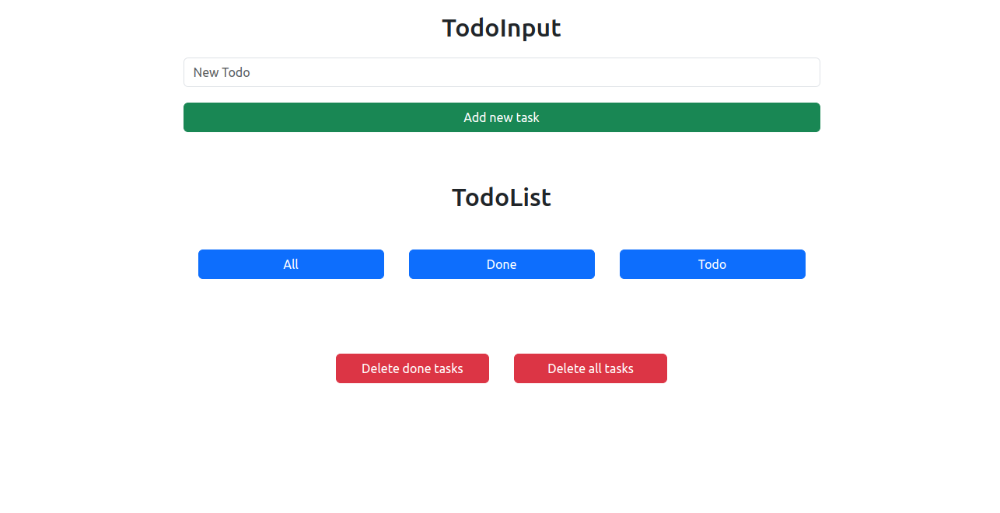

# ToDo List App

A simple ToDo list application with a mock backend using JSONPlaceholder.

## Table of Contents

- [Overview](#overview)
- [Features](#features)
- [Getting Started](#getting-started)
  - [Prerequisites](#prerequisites)
  - [Installation](#installation)
- [Usage](#usage)
- [Screenshots](#screenshots)
- [License](#license)

## Overview

This project is a basic ToDo list application built with HTML, CSS, and JavaScript. It includes features such as adding new tasks, displaying tasks, and deleting tasks. The tasks are stored on a mock backend using the JSONPlaceholder API.

## Features

- Add new tasks to the ToDo list.
- Display a list of tasks with the ability to delete each task.
- Tasks are stored and retrieved from a mock backend (JSONPlaceholder API).

## Getting Started

### Prerequisites

- A web browser (Google Chrome, Mozilla Firefox, etc.).

### Installation

1. Clone the repository:

   ```bash
   git clone https://github.com/your-username/todo-list-app.git

## Usage

1. Open the ToDo list app in your web browser.
2. Enter a task in the input field and click the "Add Task" button to add a new task.
3. Click the "Delete" button next to a task to remove it from the list.

## Screenshots
